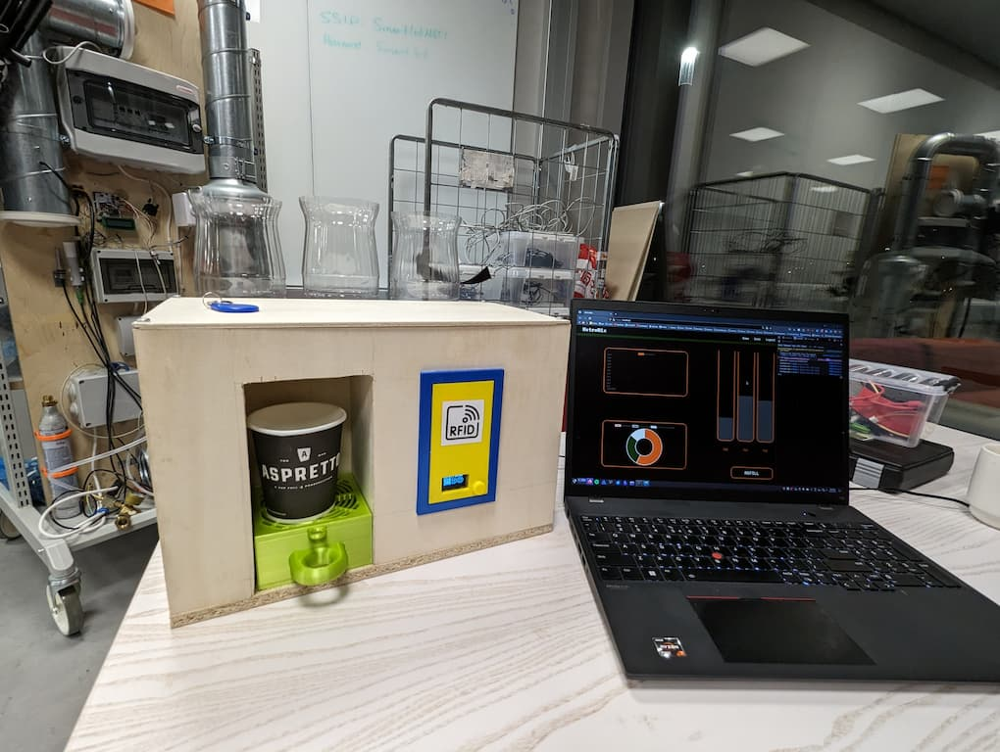
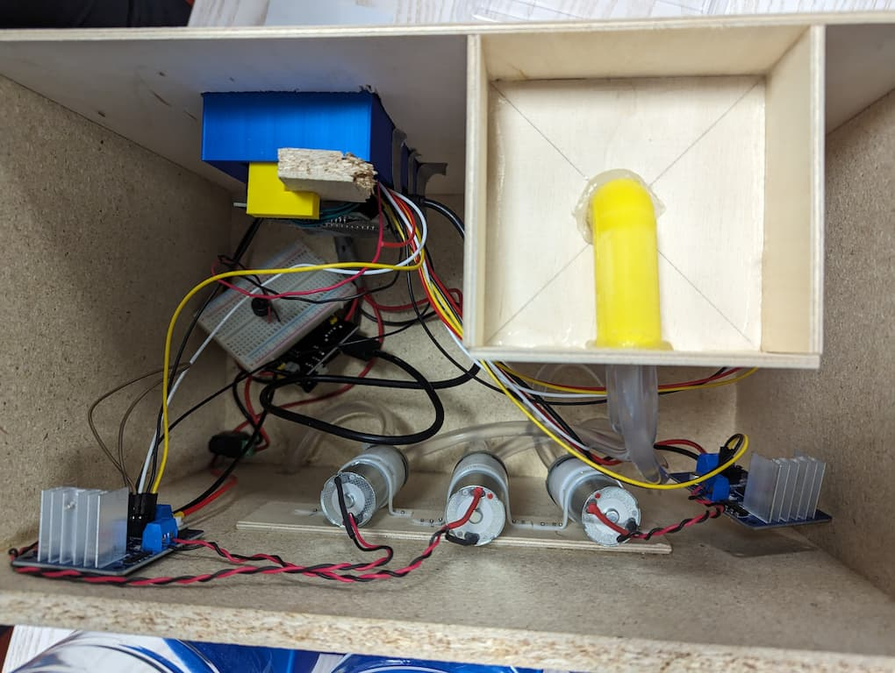

# PicoMixController - A Cocktail Mixing Machine

## Introduction

This repository contains the embedded software for a cocktail mixing machine built using a Raspberry Pi Pico W. The project was developed as part of an IoT Project course at Metropolia University in Finland. The machine is designed to dispense and mix up to three different liquids in precise, user-defined ratios. It features a user-friendly interface with an OLED display and a rotary encoder, RFID-based authentication for user access, and a web application for account management and system monitoring.

## Features

- **Multi-Liquid Dispensing**: Capable of handling up to three different liquids.
- **Precise Mixing Ratios**: Allows users to set the desired mix ratio in percent.
- **User Interface**: An OLED display and a rotary encoder for navigating menus, selecting drinks, and adjusting settings.
- **RFID Authentication**: Users authenticate with an RFID card to dispense a drink, checking against their account credits.
- **Cup Detection**: A Time-of-Flight (ToF) sensor detects the presence of a cup to prevent spillage.
- **Auditory Feedback**: A piezo buzzer provides sounds and melodies to signal different states.
- **Web Application Integration**: Communicates with a backend server for user authentication, credit management, and to display statistics and liquid levels.

## Demo

**General Demo**

**Automatic Pouring Stop**

## The Final Product

Here are some images of the final cocktail mixing machine.

**Outside View**

**Inside View**

## Hardware Components

The project is built with the following components:

1.  **Raspberry Pico W**
2.  **OLED display 128 x 64 (SSD1306)**
3.  **Rotary encoder with push button**
4.  **RFID Reader (Mifare RC522 RFID Kit)**
5.  **Time-of-Flight distance sensor (VL53L1X)**
6.  **Piezo buzzer**
7.  **3 x 370 DC diaphragm pumps**
8.  **Power supply module** for the pumps
9.  **Silicon tubing**
10. **3 x 1.5 liter bottles** as liquid containers

The case for the machine was custom-built using a combination of wooden plates and 3D-printed parts for components like container holders, a spillage tray, and the front panel.

## Embedded Software

The embedded software is written in C using the Pico SDK and leverages the FreeRTOS real-time operating system to manage concurrent tasks efficiently. This allows for simultaneous operation of the user interface, sensor readings, and pump controls.

Communication between different tasks is handled using FreeRTOS queues for data transfer and task notifications for simple signaling, ensuring thread-safe and efficient operation.

### Modules

The codebase is organized into several modules, each responsible for a specific piece of functionality, typically running in its own FreeRTOS task.

#### 1. Animation Task
This is the core of the user interface. It manages the OLED display and a state machine that controls the user flow, from drink selection to the final pouring process. It interacts with most other modules to create a cohesive user experience.

#### 2. Input Handler
Captures user inputs from the rotary encoder (rotation and push-button). It uses an interrupt-driven approach to ensure high responsiveness without bogging down the processor, sending input events to other tasks for processing.

#### 3. RFID Task
Manages the MFRC522 RFID reader. It continuously scans for RFID tags and, upon detection, sends the tag's UID to the networking task for authentication.

#### 4. Networking Task
Handles all Wi-Fi and network communication. It connects to the local network and sends HTTP POST requests to the backend server to authenticate RFID tags and validate user credits.

#### 5. Pump Task
Controls the three diaphragm pumps. It receives commands specifying which pumps to activate and for how long, allowing for the simultaneous dispensing of two liquids to create the desired mixture.

#### 6. Time of Flight (ToF) Task
Uses a VL53L1X ToF sensor to measure the distance in front of the dispenser. This is used to detect whether a cup is present before the pumps are activated, preventing spills.

#### 7. Buzzer Task
Provides auditory feedback to the user. It can play simple tones or predefined melodies to indicate events like successful authentication or the completion of a drink.

#### 8. Global State
A centralized structure that holds shared resources like FreeRTOS queue handles and task handles. This provides a single, organized place for managing inter-task communication and synchronization primitives.

## Getting Started

To build and run this project, you will need to set up the Raspberry Pi Pico C/C++ SDK. Follow the official Raspberry Pi documentation for instructions.

1.  Clone the repository.
2.  Set up your build environment using CMake.
3.  Build the project to generate the `.uf2` file.
4.  Flash the `.uf2` file to your Raspberry Pi Pico W.

An IDE like CLion with support for embedded development and FreeRTOS is recommended.
